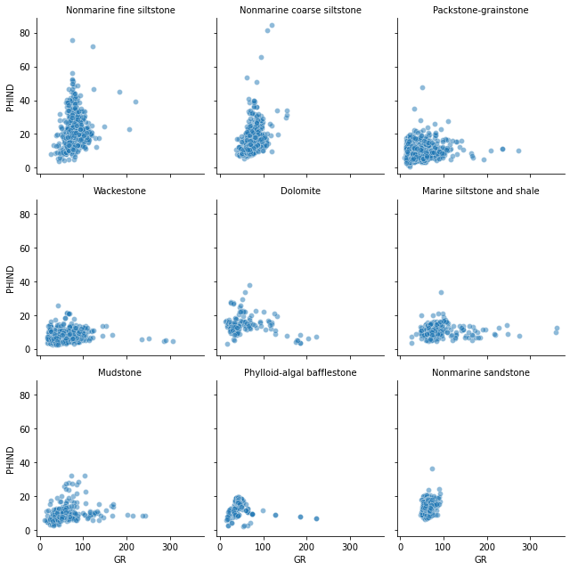
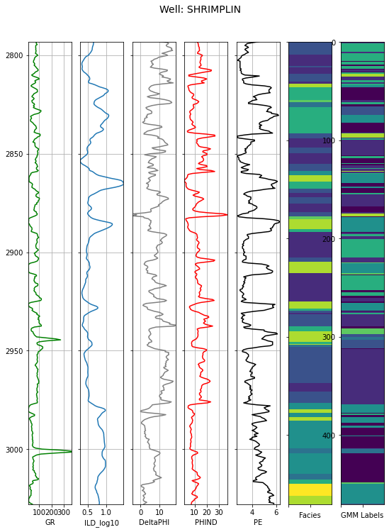
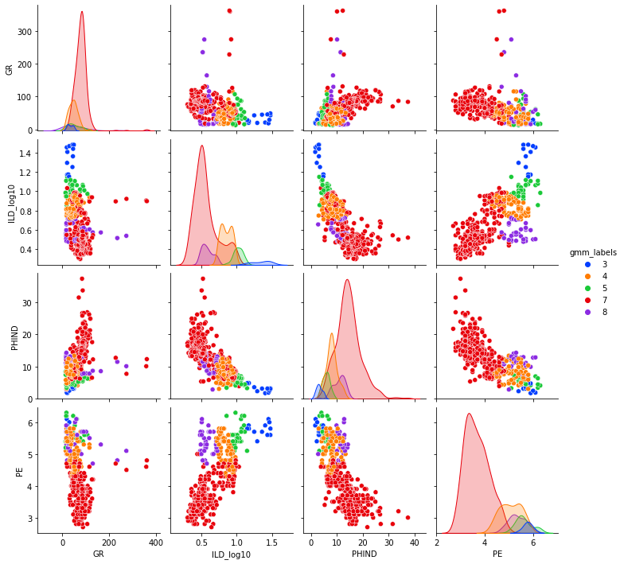

## Gaussian Mixture Modeling


*Image by Arturo Rey on Unsplash*

The Gaussian Mixture Modeling (GMM) method is another form of unsupervised classification, but unlike k-means clustering, the data being classified is assigned a probability of being in one cluster versus another.  Let's rewind a bit, and just review what I am referring to by the terms *clustering* and *cluster*.  Clustering is simply grouping similar data points together based on their attributes.  A *cluster* is just a group resulting from a clustering algorithm.

In a previous post, I used one of the most common clustering algorithms, *K-Means Clustering*, to classify well log data into groups based on similarity of different geophysical log measurements.  K-means clustering is very black or white; a point is either in cluster A or it's not.  It is a distance-based algorithm, so it attempts to group points together that are closest to a common centroid.  One drawback to k-means clustering is that it tends to form circular clusters in the data space.  This works great for some data, but not so great for other data where grouping may have different ideal shapes.

In GMM, it is assumed that there are a certain number of Gaussian distributions, each of which represents a cluster. This is a fairly intuitive assumption, since we are all familiar with the bell-shaped Gaussian or *Normal* distribution.  GMM uses elliptical decision boundaries, not circular boundaries.  These boundary shapes may make GMM a better choice for certain types of data where circular boundaries are not ideal.  An excellent discussion of the differences can be found in this post on *Analytics Vidhya*:

https://www.analyticsvidhya.com/blog/2019/10/gaussian-mixture-models-clustering/.  

I should also point out that I learned about GMM and the blog post above from another excellent blog post by Andy McDonald.  His website is a treasure-trove of great petrophysical workflows using Python.  A lot of this post is a rehashing of what he did in his post on clustering, which you can read here: 

https://www.andymcdonald.scot/blog/2021/2021-06-02-unsupervised-clustering-of-facies/.

In this post, I will return to the Hugoton (Kansas) well log data from the k-means clustering post, and use the GMM method to generate clusters.  This data set contains log data from 10 wells, as well as a field containing a *Facies* designations.  In the earlier post, we compared the clusters to Facies to see how well they matched up.  This is a little bit of a fools errand, since the facies tend to be defined more from core samples (if available) since that is the "ground truth" for many geoscientists.  I am a geoscientist myself, so I admit to a bias toward physical examination of the rock itself versus a remotely-sensed measurement of a geophysical property of the rock.

This means that *Facies* itself is human-defined, and not necessarily from the same data with which we are defining the clusters.  So don't be surprised if there isn't a very good match between Facies and clusters.  In fact, for this exercise, we shouldn't necessarily assume facies is "truth", but rather one *possible truth*.

This will be my first *blogdown* post using Python instead of R, so hopefully this will work out all right.  I did all of the work in a Jupyter notebook, and then converted that to markdown and pasted into an empty blogdown post.


```python
import pandas as pd
import matplotlib.pyplot as plt
import seaborn as sns
import numpy as np
```


```python
df = pd.read_csv("kgs_log_data.csv")
df.head()
```


<div>
<style scoped>
    .dataframe tbody tr th:only-of-type {
        vertical-align: middle;
    }

    .dataframe tbody tr th {
        vertical-align: top;
    }

    .dataframe thead th {
        text-align: right;
    }
</style>
<table border="1" class="dataframe">
  <thead>
    <tr style="text-align: right;">
      <th></th>
      <th>Facies</th>
      <th>Formation</th>
      <th>Well Name</th>
      <th>Depth</th>
      <th>GR</th>
      <th>ILD_log10</th>
      <th>DeltaPHI</th>
      <th>PHIND</th>
      <th>PE</th>
      <th>NM_M</th>
      <th>RELPOS</th>
    </tr>
  </thead>
  <tbody>
    <tr>
      <th>0</th>
      <td>3</td>
      <td>A1 SH</td>
      <td>SHRIMPLIN</td>
      <td>2793.0</td>
      <td>77.45</td>
      <td>0.664</td>
      <td>9.9</td>
      <td>11.915</td>
      <td>4.6</td>
      <td>1</td>
      <td>1.000</td>
    </tr>
    <tr>
      <th>1</th>
      <td>3</td>
      <td>A1 SH</td>
      <td>SHRIMPLIN</td>
      <td>2793.5</td>
      <td>78.26</td>
      <td>0.661</td>
      <td>14.2</td>
      <td>12.565</td>
      <td>4.1</td>
      <td>1</td>
      <td>0.979</td>
    </tr>
    <tr>
      <th>2</th>
      <td>3</td>
      <td>A1 SH</td>
      <td>SHRIMPLIN</td>
      <td>2794.0</td>
      <td>79.05</td>
      <td>0.658</td>
      <td>14.8</td>
      <td>13.050</td>
      <td>3.6</td>
      <td>1</td>
      <td>0.957</td>
    </tr>
    <tr>
      <th>3</th>
      <td>3</td>
      <td>A1 SH</td>
      <td>SHRIMPLIN</td>
      <td>2794.5</td>
      <td>86.10</td>
      <td>0.655</td>
      <td>13.9</td>
      <td>13.115</td>
      <td>3.5</td>
      <td>1</td>
      <td>0.936</td>
    </tr>
    <tr>
      <th>4</th>
      <td>3</td>
      <td>A1 SH</td>
      <td>SHRIMPLIN</td>
      <td>2795.0</td>
      <td>74.58</td>
      <td>0.647</td>
      <td>13.5</td>
      <td>13.300</td>
      <td>3.4</td>
      <td>1</td>
      <td>0.915</td>
    </tr>
  </tbody>
</table>
</div>


```python
len(df['Well Name'].unique())
```


    10


```python
df2 = df[["Well Name", "Depth", "GR", "ILD_log10", "DeltaPHI", "PHIND", "PE", "Facies"]].copy()
df2.head()
```


<div>
<style scoped>
    .dataframe tbody tr th:only-of-type {
        vertical-align: middle;
    }

    .dataframe tbody tr th {
        vertical-align: top;
    }

    .dataframe thead th {
        text-align: right;
    }
</style>
<table border="1" class="dataframe">
  <thead>
    <tr style="text-align: right;">
      <th></th>
      <th>Well Name</th>
      <th>Depth</th>
      <th>GR</th>
      <th>ILD_log10</th>
      <th>DeltaPHI</th>
      <th>PHIND</th>
      <th>PE</th>
      <th>Facies</th>
    </tr>
  </thead>
  <tbody>
    <tr>
      <th>0</th>
      <td>SHRIMPLIN</td>
      <td>2793.0</td>
      <td>77.45</td>
      <td>0.664</td>
      <td>9.9</td>
      <td>11.915</td>
      <td>4.6</td>
      <td>3</td>
    </tr>
    <tr>
      <th>1</th>
      <td>SHRIMPLIN</td>
      <td>2793.5</td>
      <td>78.26</td>
      <td>0.661</td>
      <td>14.2</td>
      <td>12.565</td>
      <td>4.1</td>
      <td>3</td>
    </tr>
    <tr>
      <th>2</th>
      <td>SHRIMPLIN</td>
      <td>2794.0</td>
      <td>79.05</td>
      <td>0.658</td>
      <td>14.8</td>
      <td>13.050</td>
      <td>3.6</td>
      <td>3</td>
    </tr>
    <tr>
      <th>3</th>
      <td>SHRIMPLIN</td>
      <td>2794.5</td>
      <td>86.10</td>
      <td>0.655</td>
      <td>13.9</td>
      <td>13.115</td>
      <td>3.5</td>
      <td>3</td>
    </tr>
    <tr>
      <th>4</th>
      <td>SHRIMPLIN</td>
      <td>2795.0</td>
      <td>74.58</td>
      <td>0.647</td>
      <td>13.5</td>
      <td>13.300</td>
      <td>3.4</td>
      <td>3</td>
    </tr>
  </tbody>
</table>
</div>


Now I will make a dictionary to map the Facies numbers to actual descriptive names.  I'm not a carbonate geologist, so I'm not entirely sure what all of these facies definitions really mean, but we'll see if any of them match up with a particular cluster.


```python
facies_dict = {1: "Nonmarine sandstone",
              2: "Nonmarine coarse siltstone",
              3: "Nonmarine fine siltstone",
              4: "Marine siltstone and shale",
              5: "Mudstone",
              6: "Wackestone",
              7: "Dolomite",
              8: "Packstone-grainstone",
              9: "Phylloid-algal bafflestone"}
```


```python
df2["Facies_names"] = df2["Facies"].map(facies_dict)
df2.head()
```


<div>
<style scoped>
    .dataframe tbody tr th:only-of-type {
        vertical-align: middle;
    }

    .dataframe tbody tr th {
        vertical-align: top;
    }

    .dataframe thead th {
        text-align: right;
    }
</style>
<table border="1" class="dataframe">
  <thead>
    <tr style="text-align: right;">
      <th></th>
      <th>Well Name</th>
      <th>Depth</th>
      <th>GR</th>
      <th>ILD_log10</th>
      <th>DeltaPHI</th>
      <th>PHIND</th>
      <th>PE</th>
      <th>Facies</th>
      <th>Facies_names</th>
    </tr>
  </thead>
  <tbody>
    <tr>
      <th>0</th>
      <td>SHRIMPLIN</td>
      <td>2793.0</td>
      <td>77.45</td>
      <td>0.664</td>
      <td>9.9</td>
      <td>11.915</td>
      <td>4.6</td>
      <td>3</td>
      <td>Nonmarine fine siltstone</td>
    </tr>
    <tr>
      <th>1</th>
      <td>SHRIMPLIN</td>
      <td>2793.5</td>
      <td>78.26</td>
      <td>0.661</td>
      <td>14.2</td>
      <td>12.565</td>
      <td>4.1</td>
      <td>3</td>
      <td>Nonmarine fine siltstone</td>
    </tr>
    <tr>
      <th>2</th>
      <td>SHRIMPLIN</td>
      <td>2794.0</td>
      <td>79.05</td>
      <td>0.658</td>
      <td>14.8</td>
      <td>13.050</td>
      <td>3.6</td>
      <td>3</td>
      <td>Nonmarine fine siltstone</td>
    </tr>
    <tr>
      <th>3</th>
      <td>SHRIMPLIN</td>
      <td>2794.5</td>
      <td>86.10</td>
      <td>0.655</td>
      <td>13.9</td>
      <td>13.115</td>
      <td>3.5</td>
      <td>3</td>
      <td>Nonmarine fine siltstone</td>
    </tr>
    <tr>
      <th>4</th>
      <td>SHRIMPLIN</td>
      <td>2795.0</td>
      <td>74.58</td>
      <td>0.647</td>
      <td>13.5</td>
      <td>13.300</td>
      <td>3.4</td>
      <td>3</td>
      <td>Nonmarine fine siltstone</td>
    </tr>
  </tbody>
</table>
</div>


Let's look at a crossplot of a couple of logs here.  We don't have the bulk density and neutron porosity curves, which are a common crossplot in carbonate rocks for determining lithology.  We do have a neutron-density porosity (PHIND), so let's crossplot that versus gamma-ray (GR) and facet by facies.


```python
g = sns.FacetGrid(df2, col="Facies_names",  col_wrap=3)
g.map(sns.scatterplot, "GR", "PHIND", alpha=0.5)
g.set_titles(col_template="{col_name}");
```


    

    


### GMM Clustering


```python
from sklearn.mixture import GaussianMixture
```


```python
# remove NaNs
df2.dropna(inplace=True)
```


```python
# create the model object and specify number of clusters
gmm = GaussianMixture(n_components=9)

# fit model to data set
gmm.fit(df2[['GR', 'ILD_log10', 'PHIND', 'DeltaPHI', 'PE']])

# predict the cluster labels
gmm_labels = gmm.predict(df2[['GR', 'ILD_log10', 'PHIND', 'DeltaPHI', 'PE']])

# add the labels back to the dataframe as a new column
df2['gmm_labels'] = gmm_labels
```


```python
df2.head()
```


<div>
<style scoped>
    .dataframe tbody tr th:only-of-type {
        vertical-align: middle;
    }

    .dataframe tbody tr th {
        vertical-align: top;
    }

    .dataframe thead th {
        text-align: right;
    }
</style>
<table border="1" class="dataframe">
  <thead>
    <tr style="text-align: right;">
      <th></th>
      <th>Well Name</th>
      <th>Depth</th>
      <th>GR</th>
      <th>ILD_log10</th>
      <th>DeltaPHI</th>
      <th>PHIND</th>
      <th>PE</th>
      <th>Facies</th>
      <th>Facies_names</th>
      <th>gmm_labels</th>
    </tr>
  </thead>
  <tbody>
    <tr>
      <th>0</th>
      <td>SHRIMPLIN</td>
      <td>2793.0</td>
      <td>77.45</td>
      <td>0.664</td>
      <td>9.9</td>
      <td>11.915</td>
      <td>4.6</td>
      <td>3</td>
      <td>Nonmarine fine siltstone</td>
      <td>0</td>
    </tr>
    <tr>
      <th>1</th>
      <td>SHRIMPLIN</td>
      <td>2793.5</td>
      <td>78.26</td>
      <td>0.661</td>
      <td>14.2</td>
      <td>12.565</td>
      <td>4.1</td>
      <td>3</td>
      <td>Nonmarine fine siltstone</td>
      <td>2</td>
    </tr>
    <tr>
      <th>2</th>
      <td>SHRIMPLIN</td>
      <td>2794.0</td>
      <td>79.05</td>
      <td>0.658</td>
      <td>14.8</td>
      <td>13.050</td>
      <td>3.6</td>
      <td>3</td>
      <td>Nonmarine fine siltstone</td>
      <td>6</td>
    </tr>
    <tr>
      <th>3</th>
      <td>SHRIMPLIN</td>
      <td>2794.5</td>
      <td>86.10</td>
      <td>0.655</td>
      <td>13.9</td>
      <td>13.115</td>
      <td>3.5</td>
      <td>3</td>
      <td>Nonmarine fine siltstone</td>
      <td>6</td>
    </tr>
    <tr>
      <th>4</th>
      <td>SHRIMPLIN</td>
      <td>2795.0</td>
      <td>74.58</td>
      <td>0.647</td>
      <td>13.5</td>
      <td>13.300</td>
      <td>3.4</td>
      <td>3</td>
      <td>Nonmarine fine siltstone</td>
      <td>6</td>
    </tr>
  </tbody>
</table>
</div>


```python
# define plotting function
def compare_clusters_plot(logs):
    #make sure logs are sorted by depth
    logs = logs.sort_values(by='Depth')
    
    ztop=logs.Depth.min(); zbot=logs.Depth.max()
    
    cluster1 = np.repeat(np.expand_dims(logs['Facies'].values,1), 100, 1)
    cluster2 = np.repeat(np.expand_dims(logs['gmm_labels'].values,1), 100, 1)
    
    f, ax = plt.subplots(nrows=1, ncols=7, figsize=(9, 12))
    ax[0].plot(logs.GR, logs.Depth, '-g')
    ax[1].plot(logs.ILD_log10, logs.Depth, '-')
    ax[2].plot(logs.DeltaPHI, logs.Depth, '-', color='0.5')
    ax[3].plot(logs.PHIND, logs.Depth, '-', color='r')
    ax[4].plot(logs.PE, logs.Depth, '-', color='black')
    im1 = ax[5].imshow(cluster1, interpolation='none', aspect='auto',vmin=1,vmax=9)
    im2 = ax[6].imshow(cluster2, interpolation='none', aspect='auto',vmin=1,vmax=9)
    
    for i in range(len(ax)-2):
        ax[i].set_ylim(ztop,zbot)
        ax[i].invert_yaxis()
        ax[i].grid()
        ax[i].locator_params(axis='x', nbins=3)
    
    ax[0].set_xlabel("GR")
    ax[0].set_xlim(logs.GR.min(),logs.GR.max())
    ax[1].set_xlabel("ILD_log10")
    ax[1].set_xlim(logs.ILD_log10.min(),logs.ILD_log10.max())
    ax[2].set_xlabel("DeltaPHI")
    ax[2].set_xlim(logs.DeltaPHI.min(),logs.DeltaPHI.max())
    ax[3].set_xlabel("PHIND")
    ax[3].set_xlim(logs.PHIND.min(),logs.PHIND.max())
    ax[4].set_xlabel("PE")
    ax[4].set_xlim(logs.PE.min(),logs.PE.max())
    ax[5].set_xlabel('Facies')
    ax[6].set_xlabel('GMM Labels')
    
    ax[1].set_yticklabels([]); ax[2].set_yticklabels([]); ax[3].set_yticklabels([])
    ax[4].set_yticklabels([]); ax[5].set_yticklabels([])
    ax[5].set_xticklabels([])
    ax[6].set_xticklabels([])
    f.suptitle('Well: %s'%logs.iloc[0]['Well Name'], fontsize=14,y=0.94)

```


```python
compare_clusters_plot(df2[df2['Well Name'] == 'SHRIMPLIN'])

```


    

    


As I mentioned in a previous post, there is no one-to-one matchup possible between the facies colors and the cluster colors in the plot above.  The cluster numbers assigned are just numbers; they have no relationship to the facies numbers, which are also arbitrary.  What is more interesting is to look for is whether blocks of depth samples match up at all, and it appears som e match up well and others, not so much.


```python
sns.pairplot(df2[df2['Well Name']=='SHRIMPLIN'], 
             vars=['GR', 'ILD_log10', 'PHIND', 'PE'], 
             hue='gmm_labels', palette='bright', diag_kind='kde');
```

    

    

```python

```

