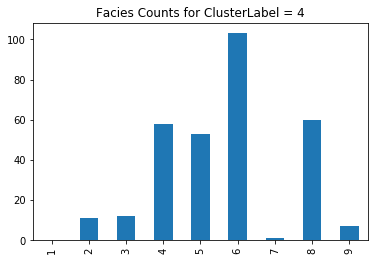

## K-Means Clustering of Well Log Data from Hugoton Gas Field, Kansas


*Photo by Zbynek Burival on Unsplash*

### Table of Contents
<ul>
<li><a href="#intro">Introduction</a></li>
<li><a href="#data">Data Description</a></li>
<li><a href="#data clean">Data Cleanup</a></li>
<li><a href="#eda">Exploratory Data Analysis</a></li>
<li><a href="#clustering">K-Means Clustering</a></li>    
<li><a href="#conclusions">Conclusions</a></li>
</ul>

<a id='intro'></a>
## Introduction:

This notebook will illustrate an application of the **k-means clustering** machine learning algorithm to geological and geophysical analyses in the oil and gas industry. Specifically, I will demonstrate an application of clustering to well log data, which are generally the most prevalent data available in oil and gas fields. In many areas, well log data may be the _only_ subsurface data available for analysis.

_What are well log data?_  Simply put, a well log is a detailed record of the material a well was drilled through.  The most basic well logs consist of written descriptions of the cuttings material brought up to the surface while drilling.  While these qualitative data can be very useful in establishing rock type and age, we also want to collect quantitative measurements of the rock layers drilled through.  To collect these measurements, special tools are lowered into the borehole, either on the drillstring or on wireline.  These tools measure and record a continuous record of certain properties of the rock or sediments lining the borehole.  These measurements, or _geophysical well logs_,  are the data we will be using as input to the clustering algorithm.

Below is an image of an old Schlumberger paper well log; thanks to the Kansas Geological Survey for the image.


Since the wells in a typical field are usually drilled through the same stratigraphic layers, grouping well log data among multiple wells could help identify correlative layers between wells by similarity in log signature.  Additionally, grouping well log samples _within a well_ can help to identify repeating assemblages of rock with common characteristics.  Such groupings may even be correlative to _facies_ designations that are usually defined from subsurface core samples.

This project was undertaken in order to utilize the capabilities of the k-means clustering algorithm, an **unsupervised machine learning** algorithm, to group samples of subsurface well log data from the Hugoton natural gas field in Kansas.  The k-means algorithm is unsupervised, meaning it does not require training on already labeled data.  Instead, it attempts to group observations into _k_ clusters, where each observation is assigned to the cluster with the nearest mean or cluster centroid.


This project was inspired by a 2016 paper in _The Leading Edge_ , the journal of the _Society of Exploration Geophysicists_ (SEG).

(<https://library.seg.org/doi/10.1190/tle35100906.1>)
 
 In that paper, Brendon Hall demonstrated the use of a **supervised** machine learning algorithm implemented with Python in a Jupyter Notebook to classify well log data into groupings based on patterns the algorithm learned from training on labeled data.  In that case, the data labels consisted of lithofacies designations, presumably defined from core samples.  The support vector machine (SVM) classification algorithm was utilized in that paper to attempt to replicate the lithofacies designations in a test dataset after training on the labeled data.

This project will use the same dataset as above, but approach the problem from another angle; rather than trying to duplicate the labels already assigned as _facies_ in the wells, the clustering algorithm will attempt to group log data points based on intrinsic similarity across multiple variables - the different log measurement variables.  These groupings can then be compared to the independently determined _facies_ designations.

<a id='data'></a>
## Data

The well log and facies data used in this project were downloaded from the SEG github repository: https://github.com/seg/tutorials-2016/tree/master/1610_Facies_classification.  This repository also contains a very informative Jupyter Notebook of the SVM analysis mentioned in the Introduction.

The data file contains subsurface data collected in 8 wells drilled in a large and well-studied gas field in Kansas called the Hugoton Field.  The data file is in comma separated format, and includes the following columns or _features_ :
- Facies
- Formation
- Well Name
- Depth
- GR
- ILD_log10
- DeltaPHI
- PHIND
- PE
- NM_M
- RELPOS

The **Facies** variable in this context refers to _lithofacies_ , which is generally defined for a sedimentary rock based on observations of grain size and mineralogy.  In many cases, a given facies is generally associated with a particular environment of deposition.  In this file the values of facies are numbers corresponding to facies labels that are further described in the Brendon Hall paper.  For instance, **Facies 1** corresponds to the label: **Nonmarine sandstone** .

In this project, the _Facies_ feature will first be ignored, and clustering will be performed based on only the log curve data to find similar patterns at different depths and in different wells.  Later in the analysis, we will compare the clusters generated by the K-means algorithm to the Facies interpreted at the same depths to see the similarities and differences.

The next two columns are also categorical variables; **Formation** refers to the formal name of the rock layer or group of layers, and **Well Name** is the name of the well from which the observation is taken. The next column, **Depth**, is the depth in feet of the observation below the surface.  

The next 5 columns (**GR, ILD_log10, DeltaPHI, PHIND, PE**) are the well log "curves" which consist of geophysical data collected by special sensors or "tools" lowered into the borehole after drilling is complete to measure properties of the rock at each depth sample.  For instance, the **GR** or _gamma ray_ log measures the natural gamma radioactivity of the rock and gives important information about the rock type, as different rock types have different content of naturally radioactive minerals. These five variables will be the input features to the clustering algorithm.

The final two features, **NM_M** and **RELPOS** will not be used in the analysis.

In the next sections of this notebook, I will import the data, perform any cleanup that is needed, do some exploratory data analysis, and then attempt to use the k-means clustering algorithm to group similar depth samples together based on the similarity of their log data values.  First I will run the clustering algorithm with only the geophysical log data as the input features, and with the same number of clusters as there are classes in the 'Facies' feature.  Then I will compare the clusters generated from the k-means algorithm with the 'Facies' groups.  I will then use the elbow method and silhouette scores to determine the optimum number of clusters.

## Import libraries and data file

The libraries necessary for the analysis wll be imported.  Then the data will be imported from a comma-separated value file on my local drive.  The data can be downloaded from the SEG repository located here: https://github.com/seg/tutorials-2016/tree/master/1610_Facies_classification.


```python
%matplotlib inline
import pandas as pd
import numpy as np
import matplotlib.pyplot as plt
import seaborn as sns
from sklearn import preprocessing
from sklearn.preprocessing import MinMaxScaler
from sklearn.cluster import KMeans
from scipy.spatial.distance import cdist
from sklearn import metrics
from scipy.spatial.distance import cdist
from mpl_toolkits.axes_grid1 import make_axes_locatable
```


```python
data_df = pd.read_csv("kgs_log_data.csv")
data_df.head()
```


<div>
<style scoped>
    .dataframe tbody tr th:only-of-type {
        vertical-align: middle;
    }

    .dataframe tbody tr th {
        vertical-align: top;
    }

    .dataframe thead th {
        text-align: right;
    }
</style>
<table border="1" class="dataframe">
  <thead>
    <tr style="text-align: right;">
      <th></th>
      <th>Facies</th>
      <th>Formation</th>
      <th>Well Name</th>
      <th>Depth</th>
      <th>GR</th>
      <th>ILD_log10</th>
      <th>DeltaPHI</th>
      <th>PHIND</th>
      <th>PE</th>
      <th>NM_M</th>
      <th>RELPOS</th>
    </tr>
  </thead>
  <tbody>
    <tr>
      <th>0</th>
      <td>3</td>
      <td>A1 SH</td>
      <td>SHRIMPLIN</td>
      <td>2793.0</td>
      <td>77.45</td>
      <td>0.664</td>
      <td>9.9</td>
      <td>11.915</td>
      <td>4.6</td>
      <td>1</td>
      <td>1.000</td>
    </tr>
    <tr>
      <th>1</th>
      <td>3</td>
      <td>A1 SH</td>
      <td>SHRIMPLIN</td>
      <td>2793.5</td>
      <td>78.26</td>
      <td>0.661</td>
      <td>14.2</td>
      <td>12.565</td>
      <td>4.1</td>
      <td>1</td>
      <td>0.979</td>
    </tr>
    <tr>
      <th>2</th>
      <td>3</td>
      <td>A1 SH</td>
      <td>SHRIMPLIN</td>
      <td>2794.0</td>
      <td>79.05</td>
      <td>0.658</td>
      <td>14.8</td>
      <td>13.050</td>
      <td>3.6</td>
      <td>1</td>
      <td>0.957</td>
    </tr>
    <tr>
      <th>3</th>
      <td>3</td>
      <td>A1 SH</td>
      <td>SHRIMPLIN</td>
      <td>2794.5</td>
      <td>86.10</td>
      <td>0.655</td>
      <td>13.9</td>
      <td>13.115</td>
      <td>3.5</td>
      <td>1</td>
      <td>0.936</td>
    </tr>
    <tr>
      <th>4</th>
      <td>3</td>
      <td>A1 SH</td>
      <td>SHRIMPLIN</td>
      <td>2795.0</td>
      <td>74.58</td>
      <td>0.647</td>
      <td>13.5</td>
      <td>13.300</td>
      <td>3.4</td>
      <td>1</td>
      <td>0.915</td>
    </tr>
  </tbody>
</table>
</div>


<a id='data clean'></a>
## Data Cleanup

Some quick inspection of the data will be performed.  Data types will be examined and edited as necessary.  Then missing data or null values will be identified and dealt with.


```python
data_df.dtypes
```


    Facies         int64
    Formation     object
    Well Name     object
    Depth        float64
    GR           float64
    ILD_log10    float64
    DeltaPHI     float64
    PHIND        float64
    PE           float64
    NM_M           int64
    RELPOS       float64
    dtype: object


Since the 'Facies' column integers represent a categorical variable, I will change their data type to categorical.


```python
data_df['Facies'] = data_df['Facies'].astype('category')
```


```python
data_df.describe()
```


<div>
<style scoped>
    .dataframe tbody tr th:only-of-type {
        vertical-align: middle;
    }

    .dataframe tbody tr th {
        vertical-align: top;
    }

    .dataframe thead th {
        text-align: right;
    }
</style>
<table border="1" class="dataframe">
  <thead>
    <tr style="text-align: right;">
      <th></th>
      <th>Depth</th>
      <th>GR</th>
      <th>ILD_log10</th>
      <th>DeltaPHI</th>
      <th>PHIND</th>
      <th>PE</th>
      <th>NM_M</th>
      <th>RELPOS</th>
    </tr>
  </thead>
  <tbody>
    <tr>
      <th>count</th>
      <td>4149.000000</td>
      <td>4149.000000</td>
      <td>4149.000000</td>
      <td>4149.000000</td>
      <td>4149.000000</td>
      <td>3232.000000</td>
      <td>4149.000000</td>
      <td>4149.000000</td>
    </tr>
    <tr>
      <th>mean</th>
      <td>2906.867438</td>
      <td>64.933985</td>
      <td>0.659566</td>
      <td>4.402484</td>
      <td>13.201066</td>
      <td>3.725014</td>
      <td>1.518438</td>
      <td>0.521852</td>
    </tr>
    <tr>
      <th>std</th>
      <td>133.300164</td>
      <td>30.302530</td>
      <td>0.252703</td>
      <td>5.274947</td>
      <td>7.132846</td>
      <td>0.896152</td>
      <td>0.499720</td>
      <td>0.286644</td>
    </tr>
    <tr>
      <th>min</th>
      <td>2573.500000</td>
      <td>10.149000</td>
      <td>-0.025949</td>
      <td>-21.832000</td>
      <td>0.550000</td>
      <td>0.200000</td>
      <td>1.000000</td>
      <td>0.000000</td>
    </tr>
    <tr>
      <th>25%</th>
      <td>2821.500000</td>
      <td>44.730000</td>
      <td>0.498000</td>
      <td>1.600000</td>
      <td>8.500000</td>
      <td>3.100000</td>
      <td>1.000000</td>
      <td>0.277000</td>
    </tr>
    <tr>
      <th>50%</th>
      <td>2932.500000</td>
      <td>64.990000</td>
      <td>0.639000</td>
      <td>4.300000</td>
      <td>12.020000</td>
      <td>3.551500</td>
      <td>2.000000</td>
      <td>0.528000</td>
    </tr>
    <tr>
      <th>75%</th>
      <td>3007.000000</td>
      <td>79.438000</td>
      <td>0.822000</td>
      <td>7.500000</td>
      <td>16.050000</td>
      <td>4.300000</td>
      <td>2.000000</td>
      <td>0.769000</td>
    </tr>
    <tr>
      <th>max</th>
      <td>3138.000000</td>
      <td>361.150000</td>
      <td>1.800000</td>
      <td>19.312000</td>
      <td>84.400000</td>
      <td>8.094000</td>
      <td>2.000000</td>
      <td>1.000000</td>
    </tr>
  </tbody>
</table>
</div>


It appears that the 'PE' column contains fewer valid values (3232) than the other columns (4149).  I will get a count of the number of null values in each variable.


```python
data_df.isnull().sum()
```


    Facies         0
    Formation      0
    Well Name      0
    Depth          0
    GR             0
    ILD_log10      0
    DeltaPHI       0
    PHIND          0
    PE           917
    NM_M           0
    RELPOS         0
    dtype: int64


It looks like there are 917 observations with null in the 'PE' column.  I will remove the observations that contain null values by creating a mask of booleans for null values in the 'PE' feature, and then use that mask to select the 'valid' observations where the 'notnull' boolean returned equals 'True'.


```python
PE_valid = data_df['PE'].notnull().values
PE_valid
```


    array([ True,  True,  True, ...,  True,  True,  True])


```python
data_df = data_df[PE_valid]
data_df.isnull().any()
```


    Facies       False
    Formation    False
    Well Name    False
    Depth        False
    GR           False
    ILD_log10    False
    DeltaPHI     False
    PHIND        False
    PE           False
    NM_M         False
    RELPOS       False
    dtype: bool


<a id='eda'></a>
## Exploratory Data Analysis

First, I will plot the well log data for one well ('SHRIMPLIN') in the format most geoscientists are used to, with depth increasing downward, and each variable plotted in its own narrow 'track'.  I will also plot the facies feature as a separate track consisting of blocks of different colors where each color block corresponds to a numbered facies label in the facies column.  

This code was modified from Alessandro Amato del Monte's tutorial on **Seismic Petrophysics** located here: https://github.com/seg/tutorials-2015/tree/master/1504_Seismic_petrophysics_1.


```python
def make_log_plot(logs):
    #make sure logs are sorted by depth
    logs = logs.sort_values(by='Depth')
    
    ztop=logs.Depth.min(); zbot=logs.Depth.max()
    
    cluster=np.repeat(np.expand_dims(logs['Facies'].values,1), 100, 1)
    
    f, ax = plt.subplots(nrows=1, ncols=6, figsize=(8, 12))
    ax[0].plot(logs.GR, logs.Depth, '-g')
    ax[1].plot(logs.ILD_log10, logs.Depth, '-')
    ax[2].plot(logs.DeltaPHI, logs.Depth, '-', color='grey')
    ax[3].plot(logs.PHIND, logs.Depth, '-', color='red')
    ax[4].plot(logs.PE, logs.Depth, '-', color='black')
    im=ax[5].imshow(cluster, interpolation='none', aspect='auto',vmin=1,vmax=9)
    
    #cbar=plt.colorbar(im, ax=ax[5])
    
    for i in range(len(ax)-1):
        ax[i].set_ylim(ztop,zbot)
        ax[i].invert_yaxis()
        ax[i].grid()
        ax[i].locator_params(axis='x', nbins=3)
    
    ax[0].set_xlabel("GR")
    ax[0].set_xlim(logs.GR.min()-20,logs.GR.max()+20)
    ax[1].set_xlabel("ILD_log10")
    ax[1].set_xlim(logs.ILD_log10.min(),logs.ILD_log10.max())
    ax[2].set_xlabel("DeltaPHI")
    ax[2].set_xlim(logs.DeltaPHI.min(),logs.DeltaPHI.max())
    ax[3].set_xlabel("PHIND")
    ax[3].set_xlim(logs.PHIND.min(),logs.PHIND.max())
    ax[4].set_xlabel("PE")
    ax[4].set_xlim(logs.PE.min(),logs.PE.max())
    ax[5].set_xlabel('Facies')
    
    ax[1].set_yticklabels([]); ax[2].set_yticklabels([]); ax[3].set_yticklabels([])
    ax[4].set_yticklabels([]); ax[5].set_yticklabels([])
    ax[5].set_xticklabels([])
    f.suptitle('Well: %s'%logs.iloc[0]['Well Name'], fontsize=14,y=0.94)
```


```python
data_df['Well Name'].unique()
```


    array(['SHRIMPLIN', 'SHANKLE', 'LUKE G U', 'CROSS H CATTLE', 'NOLAN',
           'Recruit F9', 'NEWBY', 'CHURCHMAN BIBLE'], dtype=object)


```python
make_log_plot(data_df[data_df['Well Name'] == 'SHRIMPLIN'])
```


    

    


Next I will plot histograms of the different features to inspect the distributions.


```python
fig = plt.figure(figsize = (8,8))
ax = fig.gca()
data_df.drop(['Facies','Formation','Well Name','NM_M','RELPOS'], axis=1).hist(ax=ax)
plt.show();
```

    C:\Users\akwoh\Anaconda3\lib\site-packages\ipykernel_launcher.py:3: UserWarning: To output multiple subplots, the figure containing the passed axes is being cleared
      This is separate from the ipykernel package so we can avoid doing imports until
    


    

    


Next, let's look at the distributions of each feature for one well, and also cross-plot the features against one-another.  The **Seaborn** library has a great method called _pairplot_ for crossplotting quantitative data for all the pairs of variables in a dataframe.

Let's use _pairplot_ to look at the log data the first well, 'SHRIMPLIN':


```python
sns.pairplot(data_df[data_df['Well Name']=='SHRIMPLIN']
             .drop(['Facies','Formation','Depth','NM_M','RELPOS'], axis=1));
```


    

    


None of the scatter plots of pairs of features show obvious clusters that can be broken out visually, but I am hoping that the k-means algorithm can find meaningful clusters in the data that might yield insights into repeated patterns within the same well, as well as correlating strata from well to well.

<a id='clustering'></a>
## K-means Clustering:

To prepare the data for the clustering algorithm, I will start by dropping the columns that will not be used in th algorithm: Facies, Formation, Well Name, Depth, NM_M, and RELPOS.


```python
print(list(data_df.columns))
```

    ['Facies', 'Formation', 'Well Name', 'Depth', 'GR', 'ILD_log10', 'DeltaPHI', 'PHIND', 'PE', 'NM_M', 'RELPOS']
    


```python
features_clust = data_df.drop(['Facies', 'Formation', 'Well Name', 'Depth','NM_M', 'RELPOS'], axis=1)
features_clust.head()
```


<div>
<style scoped>
    .dataframe tbody tr th:only-of-type {
        vertical-align: middle;
    }

    .dataframe tbody tr th {
        vertical-align: top;
    }

    .dataframe thead th {
        text-align: right;
    }
</style>
<table border="1" class="dataframe">
  <thead>
    <tr style="text-align: right;">
      <th></th>
      <th>GR</th>
      <th>ILD_log10</th>
      <th>DeltaPHI</th>
      <th>PHIND</th>
      <th>PE</th>
    </tr>
  </thead>
  <tbody>
    <tr>
      <th>0</th>
      <td>77.45</td>
      <td>0.664</td>
      <td>9.9</td>
      <td>11.915</td>
      <td>4.6</td>
    </tr>
    <tr>
      <th>1</th>
      <td>78.26</td>
      <td>0.661</td>
      <td>14.2</td>
      <td>12.565</td>
      <td>4.1</td>
    </tr>
    <tr>
      <th>2</th>
      <td>79.05</td>
      <td>0.658</td>
      <td>14.8</td>
      <td>13.050</td>
      <td>3.6</td>
    </tr>
    <tr>
      <th>3</th>
      <td>86.10</td>
      <td>0.655</td>
      <td>13.9</td>
      <td>13.115</td>
      <td>3.5</td>
    </tr>
    <tr>
      <th>4</th>
      <td>74.58</td>
      <td>0.647</td>
      <td>13.5</td>
      <td>13.300</td>
      <td>3.4</td>
    </tr>
  </tbody>
</table>
</div>


### Scale the features

I will use the StandardScaler function from SciKit-Learn's preprocessing module to standardize the scaling for the features.


```python
scaler = preprocessing.StandardScaler().fit(features_clust)
scaled_clust = scaler.transform(features_clust)
```


```python
fig = plt.figure(figsize = (8,8))
ax = fig.gca()
pd.DataFrame(scaled_clust).hist(ax=ax)
plt.show()
```

    C:\Users\akwoh\Anaconda3\lib\site-packages\ipykernel_launcher.py:3: UserWarning: To output multiple subplots, the figure containing the passed axes is being cleared
      This is separate from the ipykernel package so we can avoid doing imports until
    


    

    


### Run the K-means clustering algorithm 

Now the algorithm can be run on the scaled features to generate the clusters.  The only parameter input required to the algorithm is the number of clusters.  Since the Facies column contains 9 facies, I will start by generating 9 clusters to see how they compare.


```python
clust_kmeans = KMeans(n_clusters=9, init='k-means++')
clust_kmeans.fit(scaled_clust)
```


    KMeans(n_clusters=9)


I can extract the labels generated for the clusters and write them out to a NumPy array.


```python
clust_labels = clust_kmeans.labels_
```


```python
clust_labels.shape
```


    (3232,)


Let's see the first 100 labels in the array:


```python
clust_labels[0:100]
```


    array([5, 3, 3, 3, 3, 3, 3, 3, 3, 3, 3, 3, 3, 3, 3, 3, 3, 3, 7, 7, 7, 7,
           7, 7, 7, 7, 7, 7, 3, 3, 3, 3, 3, 3, 0, 3, 3, 3, 3, 3, 3, 3, 3, 3,
           0, 4, 4, 5, 5, 5, 5, 5, 5, 5, 5, 4, 4, 5, 5, 3, 3, 3, 3, 3, 5, 5,
           5, 4, 5, 5, 5, 5, 5, 5, 5, 4, 4, 4, 4, 4, 4, 4, 4, 4, 5, 5, 5, 5,
           5, 5, 5, 5, 5, 5, 8, 8, 8, 3, 3, 3])


### Visualize the clusters:

I will add the cluster labels to the original dataframe as a new column called 'ClusterLabels'.


```python
data_df['ClusterLabels']=clust_labels
data_df.head()
```


<div>
<style scoped>
    .dataframe tbody tr th:only-of-type {
        vertical-align: middle;
    }

    .dataframe tbody tr th {
        vertical-align: top;
    }

    .dataframe thead th {
        text-align: right;
    }
</style>
<table border="1" class="dataframe">
  <thead>
    <tr style="text-align: right;">
      <th></th>
      <th>Facies</th>
      <th>Formation</th>
      <th>Well Name</th>
      <th>Depth</th>
      <th>GR</th>
      <th>ILD_log10</th>
      <th>DeltaPHI</th>
      <th>PHIND</th>
      <th>PE</th>
      <th>NM_M</th>
      <th>RELPOS</th>
      <th>ClusterLabels</th>
    </tr>
  </thead>
  <tbody>
    <tr>
      <th>0</th>
      <td>3</td>
      <td>A1 SH</td>
      <td>SHRIMPLIN</td>
      <td>2793.0</td>
      <td>77.45</td>
      <td>0.664</td>
      <td>9.9</td>
      <td>11.915</td>
      <td>4.6</td>
      <td>1</td>
      <td>1.000</td>
      <td>5</td>
    </tr>
    <tr>
      <th>1</th>
      <td>3</td>
      <td>A1 SH</td>
      <td>SHRIMPLIN</td>
      <td>2793.5</td>
      <td>78.26</td>
      <td>0.661</td>
      <td>14.2</td>
      <td>12.565</td>
      <td>4.1</td>
      <td>1</td>
      <td>0.979</td>
      <td>3</td>
    </tr>
    <tr>
      <th>2</th>
      <td>3</td>
      <td>A1 SH</td>
      <td>SHRIMPLIN</td>
      <td>2794.0</td>
      <td>79.05</td>
      <td>0.658</td>
      <td>14.8</td>
      <td>13.050</td>
      <td>3.6</td>
      <td>1</td>
      <td>0.957</td>
      <td>3</td>
    </tr>
    <tr>
      <th>3</th>
      <td>3</td>
      <td>A1 SH</td>
      <td>SHRIMPLIN</td>
      <td>2794.5</td>
      <td>86.10</td>
      <td>0.655</td>
      <td>13.9</td>
      <td>13.115</td>
      <td>3.5</td>
      <td>1</td>
      <td>0.936</td>
      <td>3</td>
    </tr>
    <tr>
      <th>4</th>
      <td>3</td>
      <td>A1 SH</td>
      <td>SHRIMPLIN</td>
      <td>2795.0</td>
      <td>74.58</td>
      <td>0.647</td>
      <td>13.5</td>
      <td>13.300</td>
      <td>3.4</td>
      <td>1</td>
      <td>0.915</td>
      <td>3</td>
    </tr>
  </tbody>
</table>
</div>


Now I will make a bar plot of the counts of observations in each cluster.


```python
cluster_counts = data_df['ClusterLabels'].value_counts().sort_index()
cluster_counts.plot(kind='bar',title='Distribution of Data by Cluster')
plt.xlabel('Cluster Label')
plt.ylabel('Count');
```


    

    


Now I can use the Seaborn library _pairplot_ method to make crossplots of each variable against the others, this time with the data points colored by the identified cluster label.


```python
sns.pairplot(data_df.drop(['Facies','Formation','Depth','NM_M','RELPOS'], 
                          axis=1), hue='ClusterLabels', palette='bright');
```


    

    


### Compare clusters to facies classes using completeness and homogeneity

To quantitatively compare the clusters generated to the facies designations, I can calculate _completeness_ and _homogeneity_ scores.  The _completeness_ score will approach one when most of the data points that are members of a given class (i.e. facies) are elements of the same cluster.  The _homogeneity_ score approaches one when all of the clusters contain data points that are members of a single class - facies.


```python
facies = data_df['Facies']
clusters = data_df['ClusterLabels']
```


```python
from sklearn.metrics import completeness_score, homogeneity_score
```


```python
print('Completeness score: ', completeness_score(facies,clusters))
```

    Completeness score:  0.2962096055800334
    


```python
print('Homogeneity score: ', homogeneity_score(facies,clusters))
```

    Homogeneity score:  0.2965973079534308
    

These scores for completeness and homogeneity of ~0.29 imply that there is not a lot of good matching between the classes predicted by clustering and the facies assigned by geologists analyzing core samples.  This isn't too surprising since the facies were not assigned from the well log data that the clustering algorithm is using for its assignment.

### Elbow method to find optimum number of clusters

I can use what's called 'the elbow method' to infer the optimum number of clusters.  To do this, I run the clustering algorithm multiple times, stipulating a different number of clusters each time. Then I can plot the calculated 'distortion' for each number of clusters and look for an 'elbow' in the plot that corresponds to the optimum number of clusters. 


```python
distortions = []
k_range = range(1,12)
for k in k_range:
    kmeanModel = KMeans(n_clusters=k).fit(scaled_clust)
    kmeanModel.fit(scaled_clust)
    distortions.append(sum(np.min(cdist(scaled_clust, kmeanModel.cluster_centers_, 'euclidean'), axis=1)) / scaled_clust.shape[0])

# Plot the elbow
plt.plot(k_range, distortions, 'bx-')
plt.xlabel('k')
plt.ylabel('Distortion')
plt.title('The Elbow Method showing the optimal k')
plt.show()
```


    

    


The results of the elbow method in this case are somewhat ambiguous.  A good case can be made from the plot that k=3 is the optimal number of clusters for this dataset.  But it can also be argued that only splitting into three clusters is not very informative for the purpose of identifying geologic groupings.  For instance, the facies interpretations made from the core samples indicated 9 facies or groupings of depth samples.  In the plot above, there is the hint of a second, subtler elbow point at k=7 that might be worth exploring.

### Examine silhouette scores:


```python
from sklearn.metrics import silhouette_samples, silhouette_score
```


```python
silhouettes = []
k_range = range(2,12)
for i in k_range:
    clusterer = KMeans(n_clusters=i, random_state=1234)
    cluster_labels = clusterer.fit_predict(scaled_clust)
    silhouette_avg = silhouette_score(scaled_clust, cluster_labels)
    silhouettes.append(silhouette_avg)
    print("For n_clusters =", i,
         "The average silhouette_score is :", silhouette_avg)
```

    For n_clusters = 2 The average silhouette_score is : 0.2980973158360799
    For n_clusters = 3 The average silhouette_score is : 0.3283572639411073
    For n_clusters = 4 The average silhouette_score is : 0.34651965483109354
    For n_clusters = 5 The average silhouette_score is : 0.34124894687435403
    For n_clusters = 6 The average silhouette_score is : 0.2563094946163387
    For n_clusters = 7 The average silhouette_score is : 0.24570749063784286
    For n_clusters = 8 The average silhouette_score is : 0.2452964267243707
    For n_clusters = 9 The average silhouette_score is : 0.24967351969385218
    For n_clusters = 10 The average silhouette_score is : 0.23992623535876015
    For n_clusters = 11 The average silhouette_score is : 0.24420070985259315
    


```python
plt.plot(k_range, silhouettes)
plt.xlabel('k')
plt.ylabel('Silhouette Average')
plt.title('Silhouette average versus k')
plt.show()
```


    

    


Silhouette analysis suggests the optimal number of k-means for this dataset is 4 or 5.

### Plot clusters and facies to compare

Let's plot the logs again along with the facies and clusters as color blocked tracks.


```python
def compare_clusters_plot(logs):
    #make sure logs are sorted by depth
    logs = logs.sort_values(by='Depth')
    
    ztop=logs.Depth.min(); zbot=logs.Depth.max()
    
    cluster1 = np.repeat(np.expand_dims(logs['Facies'].values,1), 100, 1)
    cluster2 = np.repeat(np.expand_dims(logs['ClusterLabels'].values,1), 100, 1)
    
    f, ax = plt.subplots(nrows=1, ncols=7, figsize=(9, 12))
    ax[0].plot(logs.GR, logs.Depth, '-g')
    ax[1].plot(logs.ILD_log10, logs.Depth, '-')
    ax[2].plot(logs.DeltaPHI, logs.Depth, '-', color='0.5')
    ax[3].plot(logs.PHIND, logs.Depth, '-', color='r')
    ax[4].plot(logs.PE, logs.Depth, '-', color='black')
    im1 = ax[5].imshow(cluster1, interpolation='none', aspect='auto',vmin=1,vmax=9)
    im2 = ax[6].imshow(cluster2, interpolation='none', aspect='auto',vmin=1,vmax=9)
    
    for i in range(len(ax)-2):
        ax[i].set_ylim(ztop,zbot)
        ax[i].invert_yaxis()
        ax[i].grid()
        ax[i].locator_params(axis='x', nbins=3)
    
    ax[0].set_xlabel("GR")
    ax[0].set_xlim(logs.GR.min(),logs.GR.max())
    ax[1].set_xlabel("ILD_log10")
    ax[1].set_xlim(logs.ILD_log10.min(),logs.ILD_log10.max())
    ax[2].set_xlabel("DeltaPHI")
    ax[2].set_xlim(logs.DeltaPHI.min(),logs.DeltaPHI.max())
    ax[3].set_xlabel("PHIND")
    ax[3].set_xlim(logs.PHIND.min(),logs.PHIND.max())
    ax[4].set_xlabel("PE")
    ax[4].set_xlim(logs.PE.min(),logs.PE.max())
    ax[5].set_xlabel('Facies')
    ax[6].set_xlabel('ClusterLabels')
    
    ax[1].set_yticklabels([]); ax[2].set_yticklabels([]); ax[3].set_yticklabels([])
    ax[4].set_yticklabels([]); ax[5].set_yticklabels([])
    ax[5].set_xticklabels([])
    ax[6].set_xticklabels([])
    f.suptitle('Well: %s'%logs.iloc[0]['Well Name'], fontsize=14,y=0.94)
```


```python
compare_clusters_plot(data_df[data_df['Well Name'] == 'SHRIMPLIN'])
```


    

    


It is difficult to compare the 'Facies' and 'ClusterLabels' tracks because the colors don't match up.  It would be easier to compare if I could map the most likely matching 'Facies' and 'ClusterLabels' values to one another so that they shared the same color on both tracks, but I haven't figured out how to do that yet.

But it does appear that the clustering algorithm has identified similar blocks of data as were identified as being of the same facies.  So k-means clustering could be useful as a way of quickly flagging similar rock layers in many wells that have the same well log data available.

Let's look at the counts of facies labels for each ClusterLabel to see if there are any obvious matches between facies and cluster.  I can make a bar plot for each cluster showing the counts for each facies as a bar.


```python
for i in range(0,9):
    facies_counts = data_df[data_df['ClusterLabels']==i]['Facies'].value_counts().sort_index()
    facies_counts.plot(kind='bar', title=f"Facies Counts for ClusterLabel = {i}")
    plt.show();
```


    

    


    

    


    

    


    

    


    

    


    

    


    

    


    

    


    

    


These plots show that for some ClusterLabels, like clusters 0, 3, 4, 5, 6, and 7, there is a dominant facies, while for clusters 1, 2, and 8, there are multiple facies with similar peaks heights.  So there is not a one-to-one match between facies and clusters.  But the clustering exercies has been successful at identifying consistent groupings of the well log data, both within a well, and between wells.

It might be interesting to also see how the identified clusters vary from well to well.  I will have to think about a way to visualize the variation in cluster counts by well, and how to plot multiple wells to look for correlation of clusters from well to well.

<a id='intro'></a>
## Conclusion

The k-means clustering method was successful at identifying groupings of observations of well log data using the different geophysical logs as features.  The groupings identified by clustering bore some resemblance to the predefined _Facies_ classes in the dataset, although there was not a one-to-one match between clusters and facies classes.

While the dataset contained 9 facies classes, the _elbow method_ and _silhouette scores_ suggested a smaller number of clusters was optimal for this dataset.  The elbow method indicated suggested that 3 clusters was optimal, while the silhouette scores suggested 4-5 clusters was more appropriate.

I hope to do additional work with these cluster classes to ascertain how correlative the clusters are from well to well, and how consistent the identification of clusters is in the wells.  In the meantime, thanks for reading this, and check out the interesting tutorials in the SEG github repository: https://github.com/seg/.  There are also some great blog posts over at **Agile Scientific** (https://agilescientific.com/blog) which is where I first learned about the SEG paper I mentioned in the introduction.
